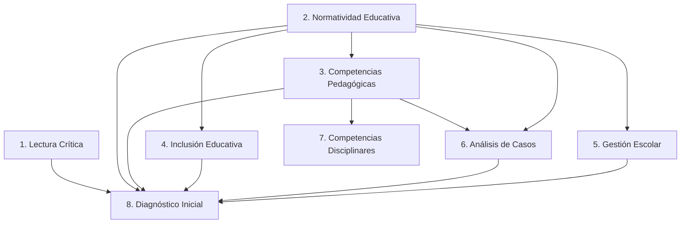

# Blueprint del Banco de Ítems
## Matriz General de Especificaciones — Plan de Construcción
### Programa de Preparación — Concurso Docente CNSC

**Estado:** Borrador para aprobación. Puente entre la Constitución Académica (documento aprobado) y la construcción real del banco. **No contiene ninguna pregunta** — es el plan exacto de qué se construye, en qué orden, con qué especificación, y cómo se mantiene en el tiempo.

**Relación con la Constitución Académica:** este documento no redefine ningún principio — toma las reglas ya aprobadas (Capítulos 1-14 de la Constitución) y las convierte en un plan de ejecución secuenciado, con orden de construcción, prioridad y dependencias explícitas entre módulos.

---

## ÍNDICE

1. Matriz de especificaciones por módulo (las 19 dimensiones solicitadas)
2. Orden de construcción y dependencias entre módulos
3. Cronograma de construcción del banco
4. Estrategia de crecimiento operativa
5. Cobertura temática — verificación contra el marco real de la CNSC
6. Distribución agregada del banco completo
7. Estrategia contra duplicados y repetición
8. Estrategia de actualización ante cambios normativos

---

## 1. Matriz de especificaciones por módulo

Cada módulo se presenta como una ficha con las 19 dimensiones pedidas. Los datos de competencia/subcompetencia/tema/subtema/indicador/proceso cognitivo/dificultad/normatividad ya están definidos en la Constitución (Capítulos 5-6) y se referencian aquí sin repetir el detalle completo — esta matriz agrega las dimensiones **nuevas** de planeación: tipo de caso, tipo de distractores, longitudes exactas, cantidad objetivo, % del banco, relación entre módulos, orden de construcción, prioridad y dependencias.

---

### MÓDULO — Lectura Crítica

| Dimensión | Especificación |
|---|---|
| Competencias | Lectura crítica (única, transversal) |
| Subcompetencias | 4 — ver Constitución Cap. 5 |
| Temas | 5 |
| Subtemas | Inferencia textual · Tesis y argumento · Intención del autor · Evaluación de evidencia · Lectura de datos escolares |
| Indicadores | Ver Constitución Cap. 6 (filas Lectura Crítica) |
| Procesos cognitivos | Niveles 2-4 |
| Nivel de dificultad | Fácil 15% / Medio 35% / Alto 35% / Muy Alto 15% |
| Tipo de caso | Texto narrativo o expositivo autocontenido; textos discontinuos (tabla/gráfica) en el subtema "Lectura de datos escolares" |
| Tipo de pregunta | Opción múltiple, binario |
| Tipo de distractores | Error de inferencia (afirmación plausible no sustentada), error de alcance (generaliza más de lo que el texto permite), error de literalidad (confunde dato explícito con interpretación) |
| Longitud del caso | 150-300 palabras |
| Longitud de la pregunta | Máx. 20 palabras |
| Longitud de las opciones | 15-35 palabras, diferencia máxima 10 palabras entre opciones |
| Normatividad relacionada | No aplica directamente |
| Cantidad objetivo de preguntas | 90 (Fase 3) |
| Porcentaje del banco fijo | 15,8% |
| Relación con otros módulos | Prerrequisito conceptual de Normatividad, Inclusión, Pedagógicas, Análisis de Casos y Gestión Escolar |
| Orden de construcción | 1 (primero — sin dependencias) |
| Prioridad | Alta |
| Dependencias | Ninguna |

---

### MÓDULO — Normatividad Educativa

| Dimensión | Especificación |
|---|---|
| Competencias | Aplicación contextual de normativa educativa |
| Subcompetencias | 3 |
| Temas | 5 |
| Subtemas | Estatuto docente · Fines de la Ley 115 · Decreto 1290 y SIEE · Ley 1620 · Derechos y debido proceso |
| Indicadores | Ver Constitución Cap. 6 |
| Procesos cognitivos | Niveles 3-4 |
| Nivel de dificultad | Fácil 10% / Medio 30% / Alto 40% / Muy Alto 20% |
| Tipo de caso | Caso institucional con tensión normativa explícita (una decisión posible vs. lo que la norma exige) |
| Tipo de pregunta | Opción múltiple, binario, `fuente_normativa` obligatoria |
| Tipo de distractores | Confusión de jerarquía normativa, aplicación de norma derogada/no vigente, práctica común confundida con exigencia legal, omisión de debido proceso |
| Longitud del caso | 150-250 palabras |
| Longitud de la pregunta | Máx. 20 palabras |
| Longitud de las opciones | 15-35 palabras |
| Normatividad relacionada | Ley 115/1994, Decreto 1278/2002, Decreto 1075/2015, Decreto 1290/2009, Ley 1620/2013, Constitución Política |
| Cantidad objetivo de preguntas | 90 (Fase 3) |
| Porcentaje del banco fijo | 15,8% |
| Relación con otros módulos | Prerrequisito de Inclusión Educativa, Competencias Pedagógicas y Gestión Escolar |
| Orden de construcción | 2 (en paralelo con Lectura Crítica — sin dependencias) |
| Prioridad | Alta |
| Dependencias | Ninguna |

---

### MÓDULO — Competencias Pedagógicas

| Dimensión | Especificación |
|---|---|
| Competencias | Enseñanza, formación y valoración |
| Subcompetencias | 3 |
| Temas | 4 |
| Subtemas | Alineación curricular · Retroalimentación efectiva · Estrategias didácticas contextualizadas · Manejo de conflictos y participación |
| Indicadores | Ver Constitución Cap. 6 |
| Procesos cognitivos | Niveles 2-4 |
| Nivel de dificultad | Fácil 15% / Medio 35% / Alto 35% / Muy Alto 15% |
| Tipo de caso | Caso de aula con evidencia de desempeño de un grupo real (datos, observación, resultados previos) |
| Tipo de distractores | Solución genérica no situada, foco en el síntoma en vez de la causa, decisión pedagógicamente incoherente con la evidencia presentada |
| Tipo de pregunta | Opción múltiple, binario |
| Longitud del caso | 180-300 palabras |
| Longitud de la pregunta | Máx. 22 palabras |
| Longitud de las opciones | 15-40 palabras |
| Normatividad relacionada | Decreto 1290/2009, Ley 115/1994, lineamientos curriculares MEN |
| Cantidad objetivo de preguntas | 120 (Fase 3) — el banco más grande |
| Porcentaje del banco fijo | 21,1% |
| Relación con otros módulos | Depende de Normatividad e Inclusión; alimenta Análisis de Casos |
| Orden de construcción | 3 |
| Prioridad | Alta |
| Dependencias | Normatividad Educativa (al menos Fase 1 completa) |

---

### MÓDULO — Inclusión Educativa

| Dimensión | Especificación |
|---|---|
| Competencias | Inclusión y atención a la diversidad |
| Subcompetencias | 4 |
| Temas | 4 |
| Subtemas | DUA aplicado · PIAR y ajustes razonables · Barreras de participación · Decreto 1421 |
| Indicadores | Ver Constitución Cap. 6 |
| Procesos cognitivos | Niveles 3-4 |
| Nivel de dificultad | Fácil 10% / Medio 30% / Alto 40% / Muy Alto 20% |
| Tipo de caso | Caso de aula con estudiante con discapacidad o barrera de aprendizaje explícita |
| Tipo de distractores | Exoneración disfrazada de ajuste, ajuste desproporcionado (excesivo o insuficiente), traslado indebido de responsabilidad a la familia |
| Tipo de pregunta | Binario mayoritario; idoneidad graduada en los casos con más de una respuesta parcialmente adecuada |
| Longitud del caso | 150-250 palabras |
| Longitud de la pregunta | Máx. 20 palabras |
| Longitud de las opciones | 15-35 palabras |
| Normatividad relacionada | Decreto 1421/2017, Decreto 1075/2015, Ley 1618/2013, Ley 115/1994 |
| Cantidad objetivo de preguntas | 60 (Fase 3) |
| Porcentaje del banco fijo | 10,5% |
| Relación con otros módulos | Depende de Normatividad; comparte casos límite con Pedagógicas y Análisis de Casos |
| Orden de construcción | 4 |
| Prioridad | Media |
| Dependencias | Normatividad Educativa |

---

### MÓDULO — Análisis de Casos

| Dimensión | Especificación |
|---|---|
| Competencias | 6 competencias comportamentales |
| Subcompetencias | 12 (2 por competencia) — ver Constitución Cap. 5 |
| Temas | 6 |
| Subtemas | 12 — ver Constitución Cap. 5 |
| Indicadores | Puntaje graduado por cercanía a idoneidad — ver Constitución Cap. 6 |
| Procesos cognitivos | Niveles 3-4 exclusivo |
| Nivel de dificultad | Fácil 5% / Medio 25% / Alto 45% / Muy Alto 25% |
| Tipo de caso | Dilema situacional sin respuesta obviamente correcta, mínimo 3 actores involucrados |
| Tipo de distractores | No aplica el concepto de "distractor descartable" — las 4 opciones son respuestas reales con distinto grado de idoneidad (0-4), nunca absurdas |
| Tipo de pregunta | "MÁS adecuada" / "MENOS adecuada" (mezcla), idoneidad graduada 0-4 |
| Longitud del caso | 150-300 palabras |
| Longitud de la pregunta | Máx. 15 palabras (formato fijo: "¿Cuál es la respuesta MÁS/MENOS adecuada ante esta situación?") |
| Longitud de las opciones | 20-40 palabras (más largas que el resto del banco — deben describir una acción completa) |
| Normatividad relacionada | Ley 1620/2013, Decreto 1075/2015, Código Único Disciplinario (cuando aplique) |
| Cantidad objetivo de preguntas | 90 (Fase 3), 15 por competencia |
| Porcentaje del banco fijo | 15,8% |
| Relación con otros módulos | Recibe casos de Pedagógicas y Normatividad — mayor integración transversal |
| Orden de construcción | 6 |
| Prioridad | Alta |
| Dependencias | Competencias Pedagógicas y Normatividad Educativa (al menos Fase 1 completas) |

---

### MÓDULO — Gestión Escolar

| Dimensión | Especificación |
|---|---|
| Competencias | Gobierno escolar y gestión institucional |
| Subcompetencias | 3 |
| Temas | 3 |
| Subtemas | Órganos de gobierno escolar · PEI y coherencia institucional · Gestión académica y directiva · Gestión comunitaria |
| Indicadores | Ver Constitución Cap. 6 |
| Procesos cognitivos | Niveles 2-3 |
| Nivel de dificultad | Fácil 15% / Medio 35% / Alto 35% / Muy Alto 15% |
| Tipo de caso | Caso institucional (no de aula) sobre una decisión de gobierno escolar o gestión |
| Tipo de distractores | Confusión de instancia competente, decisión unilateral sin consulta institucional debida, omisión del PEI como marco de referencia |
| Tipo de pregunta | Opción múltiple, binario |
| Longitud del caso | 150-250 palabras |
| Longitud de la pregunta | Máx. 20 palabras |
| Longitud de las opciones | 15-35 palabras |
| Normatividad relacionada | Ley 115/1994 (arts. 142-145), Decreto 1075/2015, Ley 715/2001 |
| Cantidad objetivo de preguntas | 60 (Fase 3) |
| Porcentaje del banco fijo | 10,5% |
| Relación con otros módulos | Depende de Normatividad; comparte casos límite con Análisis de Casos |
| Orden de construcción | 5 |
| Prioridad | Media |
| Dependencias | Normatividad Educativa |

---

### MÓDULO — Competencias Disciplinares (multi-banco)

| Dimensión | Especificación |
|---|---|
| Competencias | Saber disciplinar aplicado a la enseñanza (varía por área) |
| Subcompetencias | Varían por área — ver Constitución Cap. 5 |
| Temas | 4 por área |
| Subtemas | Comprensión disciplinar · Problemas contextualizados · Interpretación de datos · Decisión pedagógica por área |
| Indicadores | Varían por área |
| Procesos cognitivos | Niveles 2-3 |
| Nivel de dificultad | Fácil 15% / Medio 35% / Alto 35% / Muy Alto 15% (uniforme entre áreas) |
| Tipo de caso | Problema disciplinar contextualizado a una situación de enseñanza real |
| Tipo de distractores | Error disciplinar específico del área, error de aplicación pedagógica (contenido correcto, decisión de enseñanza incoherente) |
| Tipo de pregunta | Opción múltiple, binario, con datos/gráficas cuando la disciplina lo amerite |
| Longitud del caso | 150-300 palabras |
| Longitud de la pregunta | Máx. 20 palabras |
| Longitud de las opciones | 15-35 palabras |
| Normatividad relacionada | Estándares Básicos de Competencias y DBA del MEN por área |
| Cantidad objetivo de preguntas | 70 por área (Fase 3), 6 áreas = 420 |
| Porcentaje del banco | No incluido en el % del banco fijo — cada aspirante ve solo su área |
| Relación con otros módulos | Depende de Competencias Pedagógicas |
| Orden de construcción | 7 (por área, en paralelo una vez Pedagógicas tiene Fase 1 completa) |
| Prioridad | Media (alta para el área piloto de Fase 1) |
| Dependencias | Competencias Pedagógicas |

---

### MÓDULO — Diagnóstico Inicial

| Dimensión | Especificación |
|---|---|
| Competencias | Autoevaluación diagnóstica |
| Subcompetencias | 3 |
| Temas | 6 (muestreo de los demás módulos) |
| Subtemas | Uno por módulo muestreado |
| Indicadores | Ver Constitución Cap. 6 |
| Procesos cognitivos | Niveles 1-2 |
| Nivel de dificultad | Fácil 30% / Medio 40% / Alto 25% / Muy Alto 5% |
| Tipo de caso | Versión simplificada de un caso ya validado de los módulos 2-7 |
| Tipo de distractores | Los mismos criterios de cada módulo de origen, en su variante más simple |
| Tipo de pregunta | Opción múltiple, binario |
| Longitud del caso | 80-150 palabras |
| Longitud de la pregunta | Máx. 18 palabras |
| Longitud de las opciones | 10-25 palabras |
| Normatividad relacionada | Heredada de los módulos muestreados |
| Cantidad objetivo de preguntas | 60 (Fase 3), 10 por módulo muestreado |
| Porcentaje del banco fijo | 10,5% |
| Relación con otros módulos | Selecciona (no genera) ítems de los bancos 2-7 ya validados |
| Orden de construcción | 8 (**último** — depende de que los demás ya tengan contenido del cual seleccionar) |
| Prioridad | Baja (no bloquea el lanzamiento de los demás módulos) |
| Dependencias | Lectura Crítica, Normatividad, Inclusión, Pedagógicas, Análisis de Casos, Gestión Escolar (todos con al menos Fase 1 completa) |

---

## 2. Orden de construcción y dependencias entre módulos

**El orden de construcción es distinto del orden de navegación del usuario** (Constitución Cap. 4). El usuario ve Diagnóstico Inicial primero; pero técnicamente ese módulo debe construirse **último**, porque selecciona ítems ya existentes de los demás — construirlo primero significaría no tener nada de dónde seleccionar.

**Lectura Crítica y Normatividad Educativa no tienen dependencias entre sí** — pueden construirse en paralelo desde el día uno. El resto del banco depende de al menos una de las dos.

---

## 3. Cronograma de construcción del banco

El cronograma se organiza por **sprints de construcción**, no por fechas de calendario fijas (evita comprometer plazos que dependen de capacidad editorial real, aún no definida). Cada sprint corresponde a completar la Fase 1 de un módulo o grupo de módulos según el orden de construcción.

| Sprint | Módulo(s) objetivo | Meta (ítems Fase 1) | Depende de |
|---|---|---|---|
| 1 | Lectura Crítica + Normatividad Educativa | 30 + 30 = 60 | — |
| 2 | Competencias Pedagógicas | 40 | Sprint 1 |
| 3 | Inclusión Educativa + Gestión Escolar | 20 + 20 = 40 | Sprint 1 |
| 4 | Análisis de Casos | 30 | Sprints 1-2 |
| 5 | Competencias Disciplinares (1 área piloto) | 30 | Sprint 2 |
| 6 | Diagnóstico Inicial | 30 (seleccionados, no nuevos) | Sprints 1-5 |
| — | **Cierre de Fase 1 (Banco Inicial)** | **~230 ítems** | Sprints 1-6 |
| 7-10 | Ampliación de los 7 módulos fijos a Fase 2 | +210 (410 total fijo) | Fase 1 completa y validada |
| 11-13 | Competencias Disciplinares, 2 áreas adicionales | +100 (150 total disciplinar) | Sprint 5 |
| — | **Cierre de Fase 2 (Primera Expansión)** | **~560 ítems** | Sprints 7-13 |
| 14-18 | Ampliación de los 7 módulos fijos a Fase 3 | +160 (570 total fijo) | Fase 2 completa y validada |
| 19-22 | Competencias Disciplinares, 3 áreas adicionales | +270 (420 total disciplinar) | Fase 2 completa |
| — | **Cierre de Fase 3 (Banco Objetivo)** | **~990 ítems** | Sprints 14-22 |

**Regla de avance:** ningún sprint se da por cerrado si los ítems producidos no superaron el Motor de Validación de Calidad (Constitución Cap. 11) con puntaje ≥95. Un sprint puede extenderse en tiempo; nunca se cierra bajando el estándar.

---

## 4. Estrategia de crecimiento operativa

- **Construcción por lotes pequeños, no por volumen.** Cada sprint produce un lote acotado (20-40 ítems) que pasa completo por el Motor de Validación antes de iniciar el siguiente lote — permite detectar patrones de error sistemático (ej. un tipo de distractor que se repite sin querer) temprano, no después de escribir cientos de ítems con el mismo defecto.
- **Un módulo, un lote a la vez.** No se mezclan módulos distintos dentro de un mismo lote de construcción, para mantener la voz y el estilo consistentes dentro de cada competencia.
- **Revisión cruzada entre lotes.** Antes de empezar el lote N+1 de un módulo, se revisan los distractores del lote N para evitar que el lote nuevo reciva sin querer el mismo patrón (Sección 7).
- **Prioridad sobre volumen ante cualquier conflicto de tiempo.** Si hay que elegir entre completar más ítems o resolver un hallazgo de calidad, la calidad tiene prioridad — un módulo con menos ítems pero 100% validados es preferible a un módulo más grande con ítems dudosos.

---

## 5. Cobertura temática — verificación contra el marco real de la CNSC

| Componente real de la CNSC | Módulo(s) de la plataforma que lo cubre |
|---|---|
| Prueba de Aptitudes y Competencias Básicas — Lectura Crítica | Lectura Crítica |
| Prueba de Aptitudes y Competencias Básicas — Competencias Ciudadanas | Gestión Escolar + Normatividad Educativa (convivencia, Ley 1620) |
| Prueba Psicotécnica: Competencias Comportamentales (Prueba de Juicio Situacional, PJS) | Análisis de Casos |
| Prueba Pedagógica — Enseñanza, Formación y Valoración | Competencias Pedagógicas |
| Componente disciplinar por área | Competencias Disciplinares |
| Marco normativo transversal (aplicable a todos los componentes) | Normatividad Educativa + Inclusión Educativa |

**Vacío que ya se cerró:** Gestión Escolar e Inclusión Educativa no tenían módulo propio antes de la Constitución Académica (Cap. 4) — ambos cubren contenido que la CNSC evalúa transversalmente (gobierno escolar, PEI, ajustes razonables) y que antes estaba disperso o ausente.

**Vacío que sigue abierto (fuera del alcance de este Blueprint):** razonamiento cuantitativo como componente independiente de Lectura Crítica — hoy vive parcialmente dentro de Competencias Disciplinares (Matemáticas) pero no como componente transversal propio, como sí lo es en la Prueba de Aptitudes y Competencias Básicas real. Se recomienda evaluar si amerita un módulo 12 en una futura revisión de la Constitución.

---

## 6. Distribución agregada del banco completo (Fase 3, banco fijo de 570 ítems)

### 6.1 Por dificultad (promedio ponderado por tamaño de módulo)

| Nivel | % del banco fijo |
|---|---|
| Fácil | ~14% |
| Medio | ~33% |
| Alto | ~37% |
| Muy Alto | ~17% |

Distribución deliberadamente sesgada hacia Alto/Muy Alto (54% combinado) — coherente con el principio de la Constitución (Cap. 1.4) de que es una prueba de selección, no un examen escolar convencional.

### 6.2 Por tipo de razonamiento (calificación)

| Tipo | % del banco fijo |
|---|---|
| Binario (correcto/incorrecto) | ~81% |
| Idoneidad graduada (0-4) | ~19% |

### 6.3 Por nivel cognitivo (estimación de planeación — la etiqueta exacta se define ítem por ítem durante la construcción)

| Nivel | % aproximado del banco fijo |
|---|---|
| 1 — Identificación | ~5% |
| 2 — Comprensión aplicada | ~30% |
| 3 — Análisis situacional | ~40% |
| 4 — Evaluación y juicio | ~25% |

### 6.4 Por normatividad citada (peso relativo, no exclusivo — una norma puede aparecer en varios módulos)

| Norma | Módulos donde aparece | Peso relativo |
|---|---|---|
| Ley 115 de 1994 | Normatividad, Pedagógicas, Gestión Escolar, Inclusión | Alto |
| Decreto 1290 de 2009 | Normatividad, Pedagógicas | Alto |
| Decreto 1421 de 2017 | Inclusión (predominante), Análisis de Casos (casos límite) | Alto (concentrado en un módulo) |
| Ley 1620 de 2013 | Normatividad, Análisis de Casos, Pedagógicas, Gestión Escolar | Alto |
| Decreto 1278/2002 y 1075/2015 | Normatividad, Gestión Escolar | Medio |
| Ley 715 de 2001 | Gestión Escolar | Bajo (concentrado) |
| Constitución Política | Normatividad (derechos fundamentales) | Medio |

---

## 7. Estrategia contra duplicados y repetición

### 7.1 Mecanismo técnico (ya implementado)
`hash_contenido` calcula una huella del contenido normalizado (espacios, mayúsculas) del caso y la pregunta — detecta duplicados exactos o casi exactos de forma automática antes de activar un ítem (Constitución Cap. 9.2, dimensión 8).

### 7.2 Lo que el hash NO detecta (y por qué se necesita una regla editorial adicional)
Dos ítems pueden tener texto completamente distinto y aun así ser **conceptualmente el mismo caso parafraseado** — el hash no lo detecta porque compara texto, no significado. Regla editorial obligatoria: **antes de escribir un ítem nuevo para un subtema, se revisan los enunciados de los ítems ya existentes de ese mismo subtema** para verificar que el nuevo caso no sea una repetición temática (mismo dilema, mismos actores, mismo desenlace, solo con nombres distintos).

### 7.3 Estrategia de variación deliberada
Para evitar que un subtema con muchos ítems empiece a sentirse repetitivo (aunque técnicamente no haya duplicados), cada ítem nuevo de un subtema con más de 5 ítems existentes debe variar al menos dos de estos tres ejes respecto a los ya existentes: tipo de institución (urbana/rural, oficial/privada), nivel educativo (primaria/secundaria/media), y tipo de actor central del caso (estudiante/familia/colega/directivo).

### 7.4 Auditoría periódica de similitud
Una vez el banco alcance la Fase 2 (Cap. 3), se recomienda una revisión periódica (no solo al momento de creación) que compare los enunciados de todo el banco entre sí usando similitud de texto, no solo hash exacto — este mecanismo automatizado es una implementación técnica pendiente, fuera del alcance de este documento (ver Constitución Cap. 14.4).

---

## 8. Estrategia de actualización ante cambios normativos

### 8.1 Principio
Todo ítem con `fuente_normativa` poblada queda **vinculado permanentemente** a una norma específica. Cuando esa norma cambia, el ítem no puede quedar "vigente por omisión" — debe auditarse explícitamente.

### 8.2 Proceso de auditoría ante un cambio normativo anunciado
1. Identificar la norma modificada o derogada (ej. "se modifica el Decreto 1290 de 2009").
2. Consultar todos los ítems del banco cuyo `fuente_normativa` referencie esa norma (consulta directa sobre el campo, ya indexable).
3. Clasificar cada ítem afectado en una de dos categorías:
   - **Cambio de forma** (se modifica un numeral, la redacción, pero el criterio evaluado por el ítem sigue siendo válido): se actualiza `fuente_normativa` como corrección menor (Constitución Cap. 12.3) — no incrementa versión.
   - **Cambio de fondo** (el criterio evaluado por el ítem ya no es correcto bajo la norma nueva): el ítem se reconstruye por completo (Constitución Cap. 11.2) — nueva versión, nunca una edición parcial.
4. Mientras un ítem está pendiente de esta clasificación, se desactiva (`activa=False`) preventivamente — nunca se deja un ítem potencialmente desactualizado visible a un aspirante.

### 8.3 Revisión periódica programada (no solo reactiva)
Además de reaccionar a cambios anunciados, se recomienda una revisión semestral programada de todos los ítems con `fuente_normativa` poblada, para detectar cambios normativos que no se anunciaron de forma destacada pero sí afectan el criterio de un ítem. Esto requiere un campo de "fecha de última verificación normativa" por ítem — pendiente de implementación técnica (se suma a la lista de campos pendientes de la Constitución, Cap. 14.3).

### 8.4 Prioridad de auditoría por módulo
Los módulos con mayor densidad normativa (Normatividad Educativa, Inclusión Educativa, Gestión Escolar — ver Sección 6.4) tienen prioridad de auditoría sobre los módulos con menor dependencia normativa directa (Lectura Crítica, Competencias Disciplinares).

---

## Resumen ejecutivo para aprobación

- **Matriz de especificaciones completa** para los 8 módulos con banco, con las 19 dimensiones pedidas (Sección 1).
- **Orden de construcción explícito y distinto del orden de navegación** — Lectura Crítica y Normatividad Educativa primero (sin dependencias), Diagnóstico Inicial al final (depende de todos los demás).
- **Cronograma por sprints** (no fechas fijas) mapeado a las 3 fases de crecimiento de la Constitución.
- **Cobertura verificada** contra el marco real de componentes de la CNSC, con un vacío identificado y documentado para revisión futura (razonamiento cuantitativo independiente).
- **Distribuciones agregadas** de dificultad, tipo de razonamiento, nivel cognitivo y normatividad para el banco completo.
- **Estrategia de duplicados en dos capas**: mecanismo técnico (`hash_contenido`) + regla editorial de revisión temática que el hash no puede detectar.
- **Estrategia de actualización normativa** con clasificación cambio de forma/cambio de fondo y desactivación preventiva ante duda.

¿Apruebas este Blueprint? Con su aprobación, iniciamos el Sprint 1: Lectura Crítica y Normatividad Educativa, Fase 1 (30 ítems cada uno).
