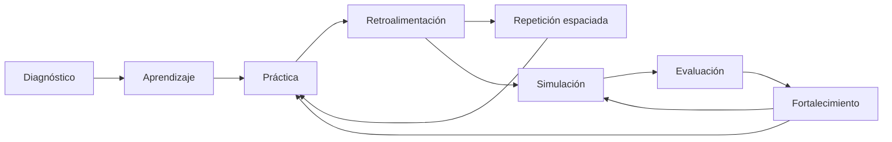

# Documento Maestro — Sistema Integral de Evaluación
## Programa de Preparación — Concurso Docente CNSC

**Versión:** 3 — Constitución Académica. **Estado:** Borrador para aprobación final. Ninguna pregunta se genera hasta que este documento quede aprobado explícitamente. Una vez aprobado, toda modificación futura del banco de ítems, la arquitectura académica o las reglas de generación por IA debe respetar este documento; cambiarlo requiere una revisión explícita, no un ajuste puntual no documentado.

---

## ÍNDICE

1. Filosofía del proyecto
2. Modelo pedagógico
3. Arquitectura de crecimiento del banco
4. Ficha funcional de los 11 módulos
5. Ficha psicométrica de los 8 módulos con banco de ítems
6. Mapa general de competencias (matriz maestra)
7. Desglose numérico por fase de crecimiento
8. Manual de construcción de ítems
9. Estándar de calidad del banco (rúbrica de 100 puntos)
10. Manual de estilo
11. Motor de validación de calidad
12. Control de versiones
13. Arquitectura para IA
14. Arquitectura técnica del banco
15. Hoja de ruta

---

## CAPÍTULO 1 — Filosofía del proyecto

### 1.1 Misión
Preparar aspirantes al Concurso Docente de la CNSC mediante una plataforma que mide y desarrolla las mismas competencias que evalúa el proceso real de selección, con el mismo rigor técnico que emplearía una institución de educación superior contratada para ese fin — no memorización de datos sueltos, sino criterio profesional aplicable en el aula real.

### 1.2 Visión
Ser reconocida por los aspirantes y por la comunidad educativa colombiana como la herramienta de preparación más rigurosa y honesta disponible: la que no promete garantías de aprobación que no puede cumplir, pero sí entrega el desarrollo de competencia real más cercano posible a la experiencia del examen oficial.

### 1.3 Principios pedagógicos
1. Aprendizaje basado en competencias, no en contenidos aislados ni en memorización de artículos normativos sueltos.
2. Evaluación auténtica — cada ítem simula una decisión profesional real, no una pregunta de manual académico.
3. El error como información, no como sanción — toda retroalimentación explica el razonamiento completo, no solo si la respuesta fue correcta.
4. Práctica deliberada — el estudio se dirige a la brecha específica detectada (Capítulo 2), no a repetir indiscriminadamente lo que el aspirante ya domina.
5. Progresión de andamiaje — los módulos de mayor carga conceptual/normativa preceden a los que exigen aplicarla (Normatividad Educativa antes de Competencias Pedagógicas, Gestión Escolar e Inclusión Educativa).

### 1.4 Principios psicométricos
1. Validez de constructo — cada ítem mide exactamente la competencia que declara medir, verificable de forma cruzada (Capítulo 11, etapa 10).
2. Un solo constructo por ítem — nunca dos competencias mezcladas sin que quede claro cuál se evalúa.
3. Dificultad progresiva y calibrada a priori (Capítulo 5), ajustada después con datos empíricos reales (Capítulo 14.4).
4. Dos modelos de calificación según el constructo: binario para conocimiento aplicado, graduado (idoneidad 0-4) para juicio situacional — nunca forzar un constructo de juicio a un modelo binario que lo distorsiona, ni viceversa.
5. Trazabilidad obligatoria — toda afirmación normativa cita su fuente exacta (ley, decreto, artículo, año).
6. Mejora continua basada en datos empíricos de uso real, no solo en el criterio inicial del autor del ítem.

### 1.5 Principios éticos
1. Honestidad sobre el alcance: la plataforma prepara y desarrolla competencia — no garantiza aprobación ni afirma tener acceso a contenido oficial filtrado de la CNSC.
2. Ningún ítem reproduce contenido protegido de terceros (simulacros comerciales de otras plataformas, material editorial con derechos reservados) — todo contenido es original, construido siguiendo este documento.
3. Protección de datos del aspirante — su historial de desempeño es privado; no se comparte ni se usa con fines distintos a su propia preparación.
4. Ausencia de sesgo — ningún ítem construye una situación que estereotipe género, región (urbana/rural), estrato socioeconómico o tipo de institución de forma injustificada (Capítulo 9, dimensión de sesgos).
5. Transparencia sobre el estado del contenido — un módulo sin ítems suficientes se muestra como en construcción; nunca se rellena con contenido de baja calidad solo para aparentar completitud.

### 1.6 Principios de experiencia de usuario
1. Claridad ante todo — nomenclatura institucional consistente (Capítulo 10), sin lenguaje comercial ni ambigüedad.
2. Retroalimentación inmediata y explicativa, nunca solo "correcto/incorrecto".
3. Progreso visible y honesto — el aspirante siempre sabe en qué fase de contenido está la plataforma (Capítulo 3) y qué tan cerca está su propio dominio de cada competencia.
4. Reducción de fricción — el aspirante nunca debe adivinar qué hacer a continuación; cada módulo comunica su propósito y su relación con los demás (Capítulo 4).
5. Accesibilidad — contraste, tamaño de texto y navegación por teclado deben cumplir un estándar mínimo (auditoría específica pendiente, fuera del alcance de este documento).

---

## CAPÍTULO 2 — Modelo pedagógico

### 2.1 El ciclo de aprendizaje

La plataforma no es lineal (diagnóstico → estudio → examen final), es un **ciclo que se repite** hasta el examen real, con ocho momentos:



### 2.2 Cómo interactúan los ocho momentos, y su módulo correspondiente

| Momento | Qué hace | Módulo que lo implementa | Estado |
|---|---|---|---|
| **Diagnóstico** | Establece la línea base real del aspirante | Módulo 1 — Diagnóstico Inicial | Implementado |
| **Aprendizaje** | El aspirante aprende resolviendo casos con retroalimentación experta (aprendizaje basado en problemas), no leyendo contenido pasivo antes de la pregunta — decisión de diseño consciente, ver 2.3 | Módulos 2-8 (banco de preguntas con justificación) | Implementado |
| **Práctica** | Repetición de ítems por competencia hasta consolidar criterio | Módulos 2-8 | Implementado |
| **Retroalimentación** | Explicación completa de por qué la respuesta correcta lo es y por qué cada distractor falla | Transversal a todos los ítems | Implementado |
| **Repetición espaciada** | Los subtemas con peor desempeño histórico del aspirante deben resurfacing con mayor frecuencia | — | **Pendiente** — hoy el sistema selecciona preguntas de forma neutral, no prioriza por debilidad detectada. Ver Fase 7, Capítulo 15. |
| **Simulación** | Ensayo de condiciones reales de examen, con tiempo límite y mezcla de componentes | Módulo 9 — Simulacro Integral | Implementado (motor de scoring), pendiente de contenido |
| **Evaluación** | Lectura técnica de resultados, identificación de patrones de error | Módulo 10 — Análisis del Desempeño | Diseñado, pendiente de implementación de tablero |
| **Fortalecimiento** | Traduce el análisis en un plan de estudio concreto que devuelve al aspirante a Práctica y Simulación, cerrando el ciclo | Módulo 11 — Plan de Fortalecimiento | Diseñado, pendiente de implementación |

### 2.3 Por qué no hay un módulo de "contenido teórico" separado
La plataforma no incluye lecciones expositivas previas a las preguntas. El modelo pedagógico es **aprendizaje basado en problemas**: el aspirante aprende resolviendo casos reales y leyendo la justificación completa (que cumple función de micro-lección), no memorizando un resumen teórico desconectado del caso. Esto es consistente con la naturaleza del Concurso Docente real, que no evalúa recordar teoría sino aplicarla — practicar de la misma forma en que se evalúa es más efectivo que separar "teoría" y "práctica" en dos experiencias distintas.

---

## CAPÍTULO 3 — Arquitectura de crecimiento del banco

### 3.1 Las tres fases y el crecimiento continuo

| Fase | Nombre | Propósito | Tamaño aproximado |
|---|---|---|---|
| Fase 1 | **Banco Inicial** | Validar el Motor de Validación de Calidad (Capítulo 11) y la experiencia real de usuario con una muestra representativa de cada módulo, antes de invertir en volumen | ~230-280 ítems |
| Fase 2 | **Primera Expansión** | Cobertura completa de los 7 bancos temáticos fijos + 3 áreas disciplinares iniciales | ~550-620 ítems |
| Fase 3 | **Banco Objetivo** | Cobertura completa de 6+ áreas disciplinares, densidad suficiente por subtema para que un usuario recurrente no perciba repetición en simulacros sucesivos | ~950-1.050 ítems |
| Continuo | **Crecimiento sin techo** | No hay fase final definida — el banco sigue creciendo mientras la plataforma esté activa | Sin límite superior |

**Por qué no se fija un número único:** un banco de una prueba de selección real nunca "termina" — se audita, se depuran los ítems de bajo desempeño psicométrico (una vez exista uso real) y se reemplazan por otros nuevos. Fijar un número único comunica erróneamente una meta final, cuando el objetivo real es un proceso continuo de calidad y ampliación.

### 3.2 Qué no cambia entre fases (la arquitectura escalable)
- `Categoria` (módulo) y `Subcategoria` (subtema) son tablas independientes del volumen de contenido — agregar el ítem 1.000 de un subtema es la misma operación que agregar el primero.
- Competencias Disciplinares ya está diseñado como multi-banco desde el modelo de datos — agregar una séptima, octava o vigésima área es crear una nueva `Subcategoria`, no modificar el modelo.
- `hash_contenido` detecta duplicados/cuasi-duplicados a cualquier escala.
- El Motor de Validación de Calidad (Capítulo 11) es un proceso, no un límite de capacidad.

**Lo único que crece con el contenido es el trabajo editorial humano o asistido por IA de escribir y validar cada ítem — nunca la infraestructura.**

### 3.3 Criterio de avance entre fases
- **Fase 1 → Fase 2:** todos los ítems del Banco Inicial superaron el Motor de Validación (Capítulo 11) con puntaje ≥95 en la rúbrica (Capítulo 9), sin excepciones.
- **Fase 2 → Fase 3:** los 7 bancos temáticos fijos tienen cobertura completa de subtemas (ningún subtema con menos de 10 ítems) y al menos 3 áreas disciplinares están activas.
- **Fase 3 → Crecimiento continuo:** el criterio de expansión pasa a ser data-driven (Capítulo 14.4): se prioriza ampliar los subtemas con mayor tasa de repetición percibida por usuarios frecuentes.

---

## CAPÍTULO 4 — Ficha funcional de los 11 módulos

Cubre los 11 módulos sin excepción, incluidos los 3 sin banco de preguntas propio.

### MÓDULO 1 — Diagnóstico Inicial
- **Propósito:** Establecer la línea base real de conocimiento y competencia del aspirante antes de iniciar el programa.
- **Función:** Punto de entrada recomendado de la ruta; primer contacto con el formato real de examen.
- **Relación con otros módulos:** Alimenta Análisis del Desempeño (línea base) y orienta la secuencia sugerida de estudio de los módulos 2-8.
- **Flujo de navegación:** Panel principal → Diagnóstico Inicial → resultado inmediato por módulo muestreado → redirección sugerida al módulo con mayor brecha.
- **Competencias que apoya:** Todas — muestreo transversal, no profundiza ninguna.
- **Datos que consume:** Ninguno.
- **Datos que genera:** Intento con puntaje por módulo muestreado, usado como línea base permanente.
- **Interacción:** Se comunica explícitamente que es diagnóstico, no evaluación de aprobación.

### MÓDULO 2 — Lectura Crítica
- **Propósito:** Desarrollar y evaluar la competencia transversal que sustenta la comprensión de casos en todos los demás módulos.
- **Función:** Entrenamiento independiente y prerrequisito conceptual (recomendado, no bloqueante).
- **Relación:** Prerrequisito de Normatividad Educativa, Inclusión Educativa, Competencias Pedagógicas, Análisis de Casos y Gestión Escolar.
- **Flujo de navegación:** Panel → Lectura Crítica → simulacro temático → resultado con retroalimentación por ítem.
- **Competencias que apoya:** Todas las que usan formato de caso extenso.
- **Datos que consume:** Ninguno.
- **Datos que genera:** Intento y detalle por pregunta.
- **Interacción:** Retroalimentación inmediata explicando por qué la inferencia correcta se sostiene.

### MÓDULO 3 — Normatividad Educativa
- **Propósito:** Dar el marco legal necesario para resolver casos, no memorizar artículos.
- **Función:** Contenido temático y prerrequisito conceptual de tres módulos posteriores.
- **Relación:** Depende de Lectura Crítica; prerrequisito de Inclusión Educativa, Competencias Pedagógicas y Gestión Escolar.
- **Flujo de navegación:** Panel → módulo → simulacro → resultado con cita normativa exacta.
- **Competencias que apoya:** Aplicación normativa en Inclusión Educativa, Competencias Pedagógicas, Gestión Escolar y Análisis de Casos.
- **Datos que consume/genera:** Patrón estándar; el detalle de norma fallida alimenta Plan de Fortalecimiento.
- **Interacción:** Cada retroalimentación cita la norma exacta.

### MÓDULO 4 — Inclusión Educativa
- **Propósito:** Formar criterio para diseñar ajustes razonables reales, no exoneraciones disfrazadas.
- **Función:** Módulo especializado, antes disperso dentro de Pedagógicas, ahora independiente.
- **Relación:** Depende de Normatividad Educativa; comparte casos límite con Competencias Pedagógicas y Análisis de Casos.
- **Flujo, datos:** Patrón estándar.
- **Interacción:** La retroalimentación distingue "ajuste razonable" de "exoneración", citando el Decreto 1421.

### MÓDULO 5 — Competencias Pedagógicas
- **Propósito:** Evaluar criterio pedagógico en planeación, evaluación formativa y didáctica situada.
- **Función:** El banco temático de mayor tamaño — refleja el peso de la Prueba Pedagógica real de la CNSC.
- **Relación:** Depende de Normatividad Educativa e Inclusión Educativa; alimenta Análisis de Casos.
- **Interacción:** Retroalimentación pedagógica detallada.

### MÓDULO 6 — Análisis de Casos
- **Propósito:** Medir juicio profesional y competencias comportamentales mediante dilemas auténticos, con calificación graduada.
- **Función:** Único módulo con calificación por idoneidad — se comunica que elegir la segunda mejor opción también otorga crédito parcial.
- **Relación:** Recibe casos de Competencias Pedagógicas y Normatividad Educativa; el módulo de mayor integración transversal.
- **Flujo de navegación:** Panel → Análisis de Casos → simulacro → resultado con desglose de idoneidad por pregunta.
- **Datos que genera:** Intento con puntaje graduado, presentado de forma diferenciada en Análisis del Desempeño.
- **Interacción:** Único módulo donde el estudiante ve explícitamente por qué una opción es mejor que otra, aunque ambas parezcan razonables.

### MÓDULO 7 — Gestión Escolar
- **Propósito:** Cubrir la comprensión institucional (gobierno escolar, PEI, gestiones del MEN) — vacío real que la plataforma no cubría.
- **Función:** Módulo nuevo, sin equivalente previo.
- **Relación:** Depende de Normatividad Educativa; comparte casos límite con Análisis de Casos.

### MÓDULO 8 — Competencias Disciplinares
- **Propósito:** Evaluar saber disciplinar aplicado a la enseñanza del área específica.
- **Función:** Único módulo multi-banco — el aspirante selecciona su área antes de acceder.
- **Relación:** Depende de Competencias Pedagógicas.
- **Flujo de navegación:** Panel → Competencias Disciplinares → selección de área → simulacro del área → resultado.
- **Datos que consume:** Área declarada por el aspirante — dato de perfil que hoy no existe formalmente (pendiente de implementación).
- **Interacción:** El aspirante solo ve contenido de su propia área.

### MÓDULO 9 — Simulacro Integral
- **Propósito:** Ensayar las condiciones reales del examen completo, bajo tiempo límite.
- **Función:** Módulo compositor — no tiene banco propio, selecciona ítems ya validados de los módulos 2-8 según la Matriz Maestra (Capítulo 6).
- **Relación:** Depende de haber avanzado al menos en Normatividad, Pedagógicas y Análisis de Casos (recomendado).
- **Flujo de navegación:** Panel → Simulacro Integral → advertencia de duración (~3 horas) → prueba completa → resultado desglosado por módulo de origen.
- **Datos que genera:** Un intento cuyo desglose por módulo de origen es el insumo más completo de Análisis del Desempeño.
- **Interacción:** Condiciones reales (temporizador visible, sin pausas).

### MÓDULO 10 — Análisis del Desempeño
- **Propósito:** Convertir resultados brutos en información accionable — tablero, no examen.
- **Función:** Módulo de solo lectura, sin preguntas propias.
- **Relación:** Consume resultados de todos los módulos con banco más Simulacro Integral; alimenta Plan de Fortalecimiento.
- **Flujo de navegación:** Panel → Análisis del Desempeño → vista por competencia → comparación contra Diagnóstico Inicial → acceso a Plan de Fortalecimiento.
- **Interacción:** Visualización, no interacción de respuesta.

### MÓDULO 11 — Plan de Fortalecimiento
- **Propósito:** Traducir el análisis de desempeño en un plan de estudio semanal concreto.
- **Función:** Módulo generador/planificador, sin banco de preguntas.
- **Relación:** Depende de Análisis del Desempeño; recomienda módulos específicos con acceso directo.
- **Flujo de navegación:** Análisis del Desempeño → Plan de Fortalecimiento (generado automáticamente) → vista semanal → seguimiento de cumplimiento.
- **Interacción:** Único módulo con interacción tipo checklist/seguimiento.

---

## CAPÍTULO 5 — Ficha psicométrica de los 8 módulos con banco de ítems

*(Contenido idéntico a la versión anterior del documento, íntegro — competencia, subcompetencias, temas, subtemas, resultados de aprendizaje, indicadores, tipo de pregunta, dificultad, procesos cognitivos, normatividad e integración, para cada uno de los 8 módulos con banco. Ver Capítulo 6 para la vista consolidada en matriz.)*

### MÓDULO 1 — Diagnóstico Inicial
**Competencia:** Autoevaluación diagnóstica. **Subcompetencias:** Lectura de consigna bajo presión de tiempo; reconocimiento del propio patrón de error; priorización basada en evidencia. **Temas:** Muestreo representativo de los 6 módulos de contenido. **Subtemas:** Uno por módulo muestreado. **Resultados de aprendizaje:** Identifica con precisión su mayor brecha relativa. **Tipo de preguntas:** 4 opciones, casos breves (80-150 palabras), binario. **Dificultad:** Fácil 30% / Medio 40% / Alto 25% / Muy Alto 5%. **Procesos cognitivos:** Niveles 1-2. **Normatividad:** Heredada de los módulos muestreados. **Integración:** Selección de los bancos 2-7, no contenido exclusivo.

### MÓDULO 2 — Lectura Crítica
**Competencia:** Inferencia, tesis, evaluación de argumentos y evidencia. **Subcompetencias:** Explícito vs. inferido; intención comunicativa; fuerza argumentativa; falacias. **Subtemas:** Inferencia textual · Tesis y argumento · Intención del autor · Evaluación de evidencia · Lectura de datos escolares. **Tipo de preguntas:** Texto 150-300 palabras + pregunta. Binario. **Dificultad:** Fácil 15% / Medio 35% / Alto 35% / Muy Alto 15%. **Procesos cognitivos:** Niveles 2-4. **Normatividad:** No aplica directamente. **Integración:** Prerrequisito de Normatividad, Inclusión y Gestión Escolar.

### MÓDULO 3 — Normatividad Educativa
**Competencia:** Aplicación contextual de normativa educativa. **Subcompetencias:** Norma pertinente; exigencia vs. práctica común; jerarquía normativa. **Subtemas:** Estatuto docente · Fines de la Ley 115 · Decreto 1290 y SIEE · Ley 1620 · Derechos y debido proceso. **Tipo de preguntas:** Casos 150-250 palabras. Binario, `fuente_normativa` citada. **Dificultad:** Fácil 10% / Medio 30% / Alto 40% / Muy Alto 20%. **Procesos cognitivos:** Niveles 3-4. **Normatividad:** Ley 115/1994, Decreto 1278/2002, Decreto 1075/2015, Decreto 1290/2009, Ley 1620/2013, Constitución Política. **Integración:** Prerrequisito de Inclusión, Pedagógicas y Gestión Escolar.

### MÓDULO 4 — Inclusión Educativa
**Competencia:** Ajustes razonables y apoyos. **Subcompetencias:** Ajuste vs. exoneración; DUA; barreras; PIAR. **Subtemas:** DUA aplicado · PIAR y ajustes razonables · Barreras de participación · Decreto 1421. **Tipo de preguntas:** Casos 150-250 palabras. Binario mayoritario, algunos graduados. **Dificultad:** Fácil 10% / Medio 30% / Alto 40% / Muy Alto 20%. **Procesos cognitivos:** Niveles 3-4. **Normatividad:** Decreto 1421/2017, Decreto 1075/2015, Ley 1618/2013, Ley 115/1994. **Integración:** Comparte eje con Normatividad; recibe el subtema "Inclusión y DUA" trasladado de Pedagógicas.

### MÓDULO 5 — Competencias Pedagógicas
**Competencia:** Enseñanza, formación y valoración (Prueba Pedagógica CNSC). **Subcompetencias:** Planeación coherente; evaluación formativa; didáctica situada. **Subtemas:** Alineación curricular · Retroalimentación efectiva · Estrategias didácticas contextualizadas · Manejo de conflictos y participación. **Tipo de preguntas:** Casos 180-300 palabras. Binario. **Dificultad:** Fácil 15% / Medio 35% / Alto 35% / Muy Alto 15%. **Procesos cognitivos:** Niveles 2-4. **Normatividad:** Decreto 1290/2009, Ley 115/1994, lineamientos MEN. **Integración:** Depende de Normatividad e Inclusión; alimenta Análisis de Casos.

### MÓDULO 6 — Análisis de Casos
**Competencia:** 6 competencias comportamentales. **Subcompetencias por competencia:**

| Competencia | Subtemas |
|---|---|
| Comunicación asertiva | Comunicación bajo presión de acudientes · Comunicación con colegas en desacuerdo |
| Liderazgo | Liderazgo sin autoridad formal · Liderazgo ante resistencia al cambio |
| Trabajo en equipo | Coordinación con desacuerdo de fondo · Corresponsabilidad en proyectos compartidos |
| Orientación al logro | Ajuste de estrategia ante estancamiento · Priorización bajo recursos limitados |
| Iniciativa | Iniciativa dentro de límites institucionales · Sistematización de soluciones informales |
| Manejo de la información | Confidencialidad de datos sensibles · Verificación antes de actuar |

**Tipo de preguntas:** Casos 150-300 palabras, "MÁS/MENOS adecuada" mezclado, idoneidad graduada 0-4. **Dificultad:** Fácil 5% / Medio 25% / Alto 45% / Muy Alto 25%. **Procesos cognitivos:** Niveles 3-4 exclusivo. **Normatividad:** Ley 1620/2013, Decreto 1075/2015, Código Único Disciplinario. **Integración:** Recibe casos de Pedagógicas y Normatividad — mayor integración transversal.

### MÓDULO 7 — Gestión Escolar
**Competencia:** Gobierno escolar y gestiones institucionales. **Subcompetencias:** Instancia competente; PEI-SIEE-plan de mejoramiento; participación docente. **Subtemas:** Órganos de gobierno escolar · PEI y coherencia institucional · Gestión académica y directiva · Gestión comunitaria. **Tipo de preguntas:** Casos 150-250 palabras. Binario. **Dificultad:** Fácil 15% / Medio 35% / Alto 35% / Muy Alto 15%. **Procesos cognitivos:** Niveles 2-3. **Normatividad:** Ley 115/1994 (arts. 142-145), Decreto 1075/2015, Ley 715/2001. **Integración:** Depende de Normatividad; comparte casos límite con Análisis de Casos.

### MÓDULO 8 — Competencias Disciplinares
**Competencia:** Saber disciplinar aplicado a la enseñanza. **Subcompetencias:** Varían por área. **Subtemas:** Comprensión disciplinar · Problemas contextualizados · Interpretación de datos · Decisión pedagógica por área. **Tipo de preguntas:** 150-300 palabras, con datos/gráficas cuando aplique. Binario. **Dificultad:** Fácil 15% / Medio 35% / Alto 35% / Muy Alto 15% (uniforme entre áreas). **Procesos cognitivos:** Niveles 2-3. **Normatividad:** Estándares Básicos de Competencias y DBA del MEN por área. **Integración:** Depende de Competencias Pedagógicas.

---

## CAPÍTULO 6 — Mapa general de competencias (matriz maestra)

Esta es la **columna vertebral de la plataforma**: cada fila representa una cadena completa Competencia → Subcompetencia → Tema → Subtema → Indicador → Nivel cognitivo → Tipo de pregunta → Normatividad → Módulo. Ningún ítem se escribe sin ubicarse primero en una fila de esta matriz.

| Módulo | Competencia | Subcompetencia/Subtema | Indicador de desempeño | Nivel cognitivo | Tipo de pregunta | Normatividad relacionada |
|---|---|---|---|---|---|---|
| Diagnóstico Inicial | Autoevaluación diagnóstica | Mapa de fortalezas y brechas | Identifica su brecha relativa mayor | 1-2 | Opción múltiple, binario | Heredada |
| Diagnóstico Inicial | Autoevaluación diagnóstica | Lectura de consignas | Interpreta correctamente qué exige la pregunta | 1-2 | Opción múltiple, binario | Heredada |
| Diagnóstico Inicial | Autoevaluación diagnóstica | Toma de decisiones inicial | Prioriza acciones según evidencia | 1-2 | Opción múltiple, binario | Heredada |
| Lectura Crítica | Lectura crítica | Inferencia textual | Distingue lo explícito de lo inferido | 2-3 | Texto + opción múltiple | No aplica |
| Lectura Crítica | Lectura crítica | Tesis y argumento | Identifica la tesis central sustentada | 2-3 | Texto + opción múltiple | No aplica |
| Lectura Crítica | Lectura crítica | Intención del autor | Interpreta el propósito comunicativo | 2 | Texto + opción múltiple | No aplica |
| Lectura Crítica | Lectura crítica | Evaluación de evidencia | Valora suficiencia y pertinencia | 3-4 | Texto + opción múltiple | No aplica |
| Lectura Crítica | Lectura crítica | Lectura de datos escolares | Interpreta tablas/gráficas de contexto escolar | 2-3 | Texto/dato + opción múltiple | No aplica |
| Normatividad Educativa | Normativa aplicada | Estatuto docente | Aplica el marco de profesionalización a un caso | 3 | Caso + opción múltiple | Decreto 1278/2002, Decreto 1075/2015 |
| Normatividad Educativa | Normativa aplicada | Fines de la Ley 115 | Relaciona una decisión con los fines legales | 2-3 | Caso + opción múltiple | Ley 115/1994 |
| Normatividad Educativa | Normativa aplicada | Decreto 1290 y SIEE | Aplica el debido proceso evaluativo institucional | 3-4 | Caso + opción múltiple | Decreto 1290/2009 |
| Normatividad Educativa | Normativa aplicada | Rutas de convivencia (Ley 1620) | Activa la ruta correcta ante un caso de convivencia | 3-4 | Caso + opción múltiple | Ley 1620/2013 |
| Normatividad Educativa | Normativa aplicada | Derechos y debido proceso | Reconoce vulneración o garantía de derechos | 3-4 | Caso + opción múltiple | Constitución Política |
| Inclusión Educativa | Inclusión y atención a la diversidad | DUA aplicado | Diseña opciones de representación/acción/motivación | 3 | Caso + opción múltiple | Decreto 1421/2017 |
| Inclusión Educativa | Inclusión y atención a la diversidad | PIAR y ajustes razonables | Distingue ajuste real de exoneración | 3-4 | Caso + opción múltiple | Decreto 1421/2017 |
| Inclusión Educativa | Inclusión y atención a la diversidad | Barreras de participación | Identifica y remueve barreras reales | 3 | Caso + opción múltiple | Decreto 1421/2017, Ley 1618/2013 |
| Competencias Pedagógicas | Enseñanza | Alineación curricular | Verifica coherencia objetivo-actividad-evidencia | 2-3 | Caso + opción múltiple | Ley 115/1994 |
| Competencias Pedagógicas | Formación | Retroalimentación efectiva | Usa el error como evidencia de aprendizaje | 2-3 | Caso + opción múltiple | Decreto 1290/2009 |
| Competencias Pedagógicas | Formación | Estrategias didácticas contextualizadas | Ajusta estrategia al contexto real del grupo | 3 | Caso + opción múltiple | Lineamientos MEN |
| Competencias Pedagógicas | Valoración | Manejo de conflictos y participación | Gestiona el clima de aula con criterio pedagógico | 3-4 | Caso + opción múltiple | Ley 1620/2013 |
| Análisis de Casos | Comunicación asertiva | Comunicación bajo presión / con colegas | Responde con firmeza y respeto simultáneos | 3-4 | Caso + idoneidad graduada | Ley 1620/2013 |
| Análisis de Casos | Liderazgo | Liderazgo sin autoridad / ante resistencia | Construye acuerdos sin imponer | 3-4 | Caso + idoneidad graduada | Decreto 1075/2015 |
| Análisis de Casos | Trabajo en equipo | Coordinación / corresponsabilidad | Resuelve desacuerdo sin fragmentar el equipo | 3-4 | Caso + idoneidad graduada | — |
| Análisis de Casos | Orientación al logro | Ajuste de estrategia / priorización | Decide con base en evidencia, no en supuestos | 3-4 | Caso + idoneidad graduada | — |
| Análisis de Casos | Iniciativa | Iniciativa institucional / sistematización | Actúa dentro de límites sin pedir permiso excesivo | 3-4 | Caso + idoneidad graduada | — |
| Análisis de Casos | Manejo de la información | Confidencialidad / verificación | Protege datos sensibles y verifica antes de actuar | 3-4 | Caso + idoneidad graduada | Ley 1620/2013 |
| Gestión Escolar | Gobierno escolar | Órganos de gobierno escolar | Identifica la instancia competente | 2-3 | Caso + opción múltiple | Ley 115/1994 (arts. 142-145) |
| Gestión Escolar | Gestión institucional | PEI y coherencia institucional | Articula una decisión con el PEI | 2-3 | Caso + opción múltiple | Decreto 1075/2015 |
| Gestión Escolar | Gestión institucional | Gestión académica y directiva | Distingue autonomía docente de decisión institucional | 3 | Caso + opción múltiple | Ley 115/1994 |
| Gestión Escolar | Gestión institucional | Gestión comunitaria | Articula la institución con familias y contexto | 2-3 | Caso + opción múltiple | Ley 715/2001 |
| Competencias Disciplinares | Saber disciplinar aplicado (por área) | Comprensión disciplinar / problemas contextualizados / datos / decisión pedagógica | Resuelve un problema del área en clave de enseñanza | 2-3 | Caso + opción múltiple (+ datos) | Estándares MEN, DBA |

*(Nota: la fila de Competencias Disciplinares es una plantilla — se repite una vez por cada área disciplinar activa, con el mismo patrón de subtemas y distinta especificidad de contenido, según el Capítulo 5, Módulo 8.)*

---

## CAPÍTULO 7 — Desglose numérico por fase de crecimiento

### 7.1 Banco fijo (7 módulos temáticos) por fase

| Módulo | Fase 1 | Fase 2 | Fase 3 |
|---|---|---|---|
| Diagnóstico Inicial | 30 | 60 | 60 |
| Lectura Crítica | 30 | 60 | 90 |
| Normatividad Educativa | 30 | 60 | 90 |
| Inclusión Educativa | 20 | 40 | 60 |
| Competencias Pedagógicas | 40 | 90 | 120 |
| Análisis de Casos | 30 | 60 | 90 |
| Gestión Escolar | 20 | 40 | 60 |
| **Subtotal fijo** | **200** | **410** | **570** |

### 7.2 Competencias Disciplinares por fase

| Fase | Áreas activas | Ítems por área | Subtotal disciplinar |
|---|---|---|---|
| Fase 1 | 1 (piloto) | 30 | 30 |
| Fase 2 | 3 | ~50 | ~150 |
| Fase 3 | 6 | ~70 | ~420 |
| Continuo | 8+ | 70-90 | 560+ (sin techo) |

### 7.3 Total por fase

| Fase | Total aproximado |
|---|---|
| Fase 1 — Banco Inicial | ~230 |
| Fase 2 — Primera Expansión | ~560 |
| Fase 3 — Banco Objetivo | ~990 |
| Continuo | Sin límite superior |

**Nota:** el Motor de Validación de Calidad (Capítulo 11) tiene prioridad sobre el cronograma — un módulo no avanza de fase con ítems que no superaron validación, aunque eso retrase el conteo total.

---

## CAPÍTULO 8 — Manual de construcción de ítems

### 8.1 Reglas para redactar el caso
1. Debe poder resolverse con la información que el enunciado entrega — nunca depender de un dato externo no dado.
2. Situación auténtica del contexto escolar colombiano, con figuras institucionales reales (SIEE, PEI, consejo académico, PIAR, acudiente).
3. Extensión según el módulo (Capítulo 8.2) — nunca menos del mínimo ni más del máximo declarado.
4. Un solo dilema por caso.
5. El caso no debe insinuar la respuesta correcta con su propio tono narrativo.

### 8.2 Longitud recomendada según tipo de competencia

| Módulo/competencia | Extensión del caso |
|---|---|
| Diagnóstico Inicial | 80-150 palabras |
| Lectura Crítica | 150-300 palabras (texto fuente) |
| Normatividad Educativa | 150-250 palabras |
| Inclusión Educativa | 150-250 palabras |
| Competencias Pedagógicas | 180-300 palabras |
| Análisis de Casos | 150-300 palabras |
| Gestión Escolar | 150-250 palabras |
| Competencias Disciplinares | 150-300 palabras |

### 8.3 Reglas para construir la pregunta
1. Pregunta directa, nunca doble negación salvo el formato "menos adecuada" explícito.
2. Prohibido "todas/ninguna de las anteriores".
3. Un solo problema por ítem.
4. Vocabulario técnico consistente con el glosario único (Capítulo 10.9).
5. El verbo de la pregunta corresponde al nivel cognitivo declarado (Capítulo 6): "identifique" (1), "explique/interprete" (2), "analice" (3), "evalúe/decida" (4).

### 8.4 Reglas para elaborar distractores
1. Los 4 deben ser plausibles — ninguno absurdo o descartable sin leer el caso.
2. Cada distractor representa un error de razonamiento documentado: pasividad/evasión, imposición sin proceso, omisión de responsabilidad, generalización indebida, confusión de jerarquía normativa, sesgo de confirmación.
3. Prohibido reciclar el mismo texto de distractor entre ítems de competencias distintas (defecto real ya detectado y corregido — 35 ítems de Análisis de Casos compartían solo 2 plantillas entre 6 competencias).
4. Longitud y complejidad gramatical comparables entre las 4 opciones.
5. Opciones mutuamente excluyentes.
6. Concordancia gramatical neutra entre enunciado y opciones.

### 8.5 Reglas de idoneidad graduada (Análisis de Casos y parte de Inclusión Educativa)
1. Escala 0-4: 4 = óptima, 3 = adecuada pero incompleta, 1-2 = poco adecuada, 0 = inadecuada.
2. En "MÁS adecuada", la opción con idoneidad 4 es la respuesta correcta.
3. En "MENOS adecuada", la opción con idoneidad 0 es la respuesta correcta.
4. Nunca dos opciones con idoneidad exactamente igual sin que la justificación explique por qué son equivalentes.

### 8.6 Criterios de calidad lingüística
Ver Capítulo 10 (Manual de Estilo) — la totalidad de las reglas de estilo aplican como parte de este manual de construcción.

### 8.7 Criterios de calidad psicométrica
- Un solo constructo por ítem, declarado explícitamente en los metadatos.
- Dificultad declarada a priori coherente con el nivel cognitivo exigido.
- Trazabilidad normativa obligatoria cuando aplique.
- Independencia entre ítems.
- Justificación que explica por qué la correcta lo es y por qué cada uno de los 3 distractores no lo es.

### 8.8 Errores que nunca deben cometerse
1. Distractores reciclados entre competencias distintas.
2. `respuesta_correcta` que no coincide con lo que la propia justificación argumenta (2 casos reales detectados y corregidos: CA-002, OL-001).
3. Preguntas de definición pura sin caso situacional.
4. Contexto insuficiente para resolver sin conocimiento externo no dado.
5. "Todas/ninguna de las anteriores".
6. Un distractor tan absurdo que se descarta sin leer el caso.
7. Longitud de opciones desigual que delata la respuesta.
8. Doble negación no justificada por el formato.
9. Justificación que solo explica la respuesta correcta y omite los distractores.
10. Ítems fuera del rango de extensión declarado (8.2).

---

## CAPÍTULO 9 — Estándar de calidad del banco (rúbrica de 100 puntos)

### 9.1 Principio
Todo ítem se autoevalúa (por la IA que lo genera) y luego se valida (Capítulo 11) contra esta rúbrica antes de poder activarse. **Un ítem con puntaje menor a 95 no se corrige: se descarta por completo y se reconstruye desde cero.** Corregir un ítem deficiente tiende a arrastrar su defecto original disfrazado; reconstruirlo desde el caso garantiza coherencia integral.

### 9.2 Las 10 dimensiones y su ponderación

| # | Dimensión | Puntos máximos | Qué mide |
|---|---|---|---|
| 1 | Calidad psicométrica | 15 | Constructo único, dificultad coherente con nivel cognitivo, independencia del ítem |
| 2 | Calidad pedagógica | 15 | El caso realmente exige la competencia declarada, no conocimiento adyacente |
| 3 | Plausibilidad de distractores | 15 | Los 4 distractores son creíbles, documentados, no reciclados |
| 4 | Calidad normativa | 10 | Cita exacta, vigente, en la jerarquía correcta cuando aplica |
| 5 | Calidad lingüística | 10 | Ortografía, tildes, puntuación, concordancia, registro (Capítulo 10) |
| 6 | Coherencia con el módulo | 10 | El ítem pertenece exactamente al módulo/subtema donde está clasificado (Capítulo 6) |
| 7 | Ausencia de sesgos | 10 | Ningún estereotipo evitable de género, región, estrato o tipo de institución |
| 8 | Originalidad | 5 | No es cuasi-duplicado de otro ítem existente (`hash_contenido`) |
| 9 | Naturalidad | 5 | El caso suena a una situación real, no a un ejercicio artificial de examen |
| 10 | Dificultad calibrada | 5 | El nivel declarado es razonable a priori frente al proceso cognitivo exigido |
| | **Total** | **100** | |

### 9.3 Bandas de puntuación por dimensión (ejemplo aplicable a las dimensiones de mayor peso)

**Dimensión 1 — Calidad psicométrica (15 pts):**
- 13-15: constructo único, perfectamente alineado con dificultad e independencia total.
- 9-12: constructo claro pero con leve ambigüedad de nivel de dificultad.
- 5-8: el ítem mide más de un constructo o depende de otro ítem.
- 0-4: no queda claro qué competencia mide.

**Dimensión 2 — Calidad pedagógica (15 pts):**
- 13-15: imposible acertar sin dominar la competencia declarada.
- 9-12: se podría acertar con sentido común general, sin dominio específico.
- 5-8: la competencia declarada es tangencial al verdadero reto del ítem.
- 0-4: el ítem mide otra cosa distinta a lo declarado.

**Dimensión 3 — Plausibilidad de distractores (15 pts):**
- 13-15: los 4 son creíbles, documentados y específicos del caso.
- 9-12: 3 de 4 son plausibles, uno es débil.
- 5-8: al menos un distractor es descartable a simple vista.
- 0-4: distractores reciclados o absurdos.

*(Las demás dimensiones siguen el mismo patrón de 4 bandas proporcionales a su puntaje máximo — el criterio siempre es: banda superior = cumplimiento total y verificable; banda inferior = incumplimiento que justifica descarte.)*

### 9.4 Relación con el Motor de Validación (Capítulo 11)
Cada una de las 10 etapas del Motor de Validación corresponde exactamente a una de las 10 dimensiones de esta rúbrica — el motor es el *proceso*, la rúbrica es la *medida numérica* de ese proceso. Un ítem no pasa una etapa del Capítulo 11 si su dimensión correspondiente puntúa por debajo del umbral proporcional (ej. menos de 12/15 en Calidad psicométrica bloquea la etapa 1).

---

## CAPÍTULO 10 — Manual de estilo

### 10.1 Longitud de párrafos
El caso se redacta en **un solo párrafo continuo**, salvo que incluya una cita normativa textual (que puede ir en párrafo aparte). Nunca más de 2 párrafos por caso — fragmentar en exceso rompe la lectura de un caso auténtico.

### 10.2 Longitud de preguntas (enunciado)
Una sola oración interrogativa, máximo 25 palabras. Ejemplo válido: "¿Cuál es la actuación más coherente con el debido proceso en este caso?"

### 10.3 Longitud de casos
Según el módulo — ver tabla completa en Capítulo 8.2.

### 10.4 Longitud de opciones
Las 4 opciones entre 15 y 40 palabras cada una, con diferencia máxima de 10 palabras entre la más corta y la más larga (evita pistas de longitud, Capítulo 8.4.4).

### 10.5 Puntuación
Signos de interrogación y exclamación de apertura y cierre (¿?, ¡!) siempre presentes — nunca omitir el signo de apertura. Comas para separar elementos de una enumeración y para incisos explicativos, no para separar sujeto y predicado. Punto final en cada opción de respuesta.

### 10.6 Uso de mayúsculas
Solo en inicio de oración y nombres propios/siglas institucionales (SIEE, PEI, PIAR, DUA, CNSC, MEN). Prohibido el uso de mayúscula sostenida para dar énfasis.

### 10.7 Uso de cursivas y negrillas
**No se usan.** Los campos `contexto`, `enunciado` y `opcion_a..d` del modelo de datos se renderizan como texto plano (Django `TextField` sin procesamiento de marcado) — cualquier `**negrilla**` o `*cursiva*` escrita en el contenido se mostraría literalmente con los asteriscos al usuario, no como texto formateado. Ningún ítem debe depender de énfasis tipográfico para comunicar significado; si algo necesita énfasis, se logra con la redacción misma (orden de palabras, precisión léxica), no con formato.

### 10.8 Tratamiento de leyes, decretos y citas
- Primera mención en un ítem: nombre completo con número y año — "Decreto 1290 de 2009", "Ley 115 de 1994".
- Menciones posteriores dentro del mismo ítem: puede abreviarse a "el Decreto 1290" o "la Ley 115".
- Citas textuales de una norma: entre comillas dobles, sin cursiva (10.7).
- El campo `fuente_normativa` siempre lleva el formato completo, independientemente de cómo se mencione en el texto del ítem: `"Ley 115 de 1994, art. X"` o `"Decreto 1290 de 2009, art. X"`.

### 10.9 Terminología oficial (glosario único)
"Aspirante" (no "candidato" ni "postulante") · "Acudiente" (no "padre de familia" exclusivamente, salvo que el caso lo requiera) · "Consejo académico"/"Consejo directivo" (nunca abreviados) · "SIEE" y "PEI" con su nombre completo la primera vez que aparecen en cada ítem · "Docente" (no "profesor" como término por defecto, salvo dentro de una cita textual o diálogo del caso).

---

## CAPÍTULO 11 — Motor de validación de calidad

Proceso obligatorio que todo ítem debe superar antes de poder activarse (`activa=True`), sin importar la fase de crecimiento del módulo.

| # | Etapa | Qué revisa | Criterio de aprobación | Dimensión de rúbrica asociada (Cap. 9) |
|---|---|---|---|---|
| 1 | Revisión psicométrica | Constructo único, dificultad coherente, independencia | ≥12/15 en Dimensión 1 | 1 |
| 2 | Revisión pedagógica | El caso exige la competencia declarada, no conocimiento adyacente | ≥12/15 en Dimensión 2 | 2 |
| 3 | Revisión normativa | Cita correcta, vigente y en jerarquía correcta | ≥8/10 en Dimensión 4 | 4 |
| 4 | Revisión lingüística | Ortografía, tildes, puntuación, concordancia, registro, Manual de Estilo (Cap. 10) | ≥8/10 en Dimensión 5 | 5 |
| 5 | Revisión de sesgos | Ausencia de estereotipos evitables | ≥8/10 en Dimensión 7 | 7 |
| 6 | Revisión de originalidad | No es cuasi-duplicado (`hash_contenido`) | ≥4/5 en Dimensión 8 | 8 |
| 7 | Revisión de coherencia con el módulo | Pertenece al módulo/subtema declarado (Matriz Maestra, Cap. 6) | ≥8/10 en Dimensión 6 | 6 |
| 8 | Revisión de dificultad | Nivel declarado razonable a priori | ≥4/5 en Dimensión 10 | 10 |
| 9 | Revisión de distractores | Los 4 cumplen las reglas de 8.4, sin reciclaje | ≥12/15 en Dimensión 3 | 3 |
| 10 | Revisión de la competencia evaluada | Coincidencia exacta entre lo declarado y lo verificado en etapas 1-2 | Verificación cruzada aprobada | 1, 2 |

**Umbral final:** la suma de las 10 dimensiones debe ser **≥95/100**. Un ítem puede superar cada etapa individualmente por encima del mínimo de esa etapa y aun así no alcanzar 95 en total — el umbral global es más estricto que la suma de mínimos individuales.

### 11.1 Regla de bloqueo automático (verificación cruzada respuesta-justificación)
Antes de cualquier revisión, todo ítem pasa una verificación automática que compara la letra marcada en `respuesta_correcta` contra el sentido (positivo/negativo) de cada opción en la `justificacion`. Si hay contradicción, el ítem se marca automáticamente como **rechazado** y no avanza a las etapas 1-10 hasta corregirse. Esta regla nace del hallazgo real descrito en 8.8.2.

### 11.2 Regla de reconstrucción, no corrección (Capítulo 9.1)
Un ítem con puntaje final menor a 95 se **descarta por completo**. No se edita el ítem existente — se reconstruye desde el caso, como si nunca hubiera existido.

### 11.3 Estado de gobernanza (pendiente de implementación técnica)
El modelo de datos actual no tiene campos de estado de revisión. Se requiere, en una fase de implementación posterior (fuera del alcance de este documento):
- Campo de estado: `borrador` → `en_revision` → `aprobado` → `publicado` (o `rechazado`).
- Registro de qué etapas (1-10) ya superó cada ítem.
- Ningún ítem pasa a `activa=True` sin las 10 etapas superadas y puntaje ≥95.

---

## CAPÍTULO 12 — Control de versiones

### 12.1 Principio de trazabilidad total
Ninguna pregunta pierde su historial. Cada ítem, desde su creación, mantiene un registro completo de quién lo escribió, cuándo, en qué versión, y qué cambios ha tenido.

### 12.2 Campos de control por ítem

| Campo | Descripción | Estado actual |
|---|---|---|
| Identificador único | Código legible (ej. `NORM-DEB-003`) además del id numérico interno | Parcialmente implementado (`titulo` cumple esta función en algunos módulos, falta estandarizar en todos) |
| Fecha de creación | Timestamp de creación del ítem | Implementado (`fecha_creacion`) |
| Versión | Número de versión del ítem (v1, v2...) — se incrementa solo si el ítem se reconstruye por completo (Capítulo 11.2), nunca por una edición menor | **Pendiente** — campo nuevo requerido |
| Autor | Quién generó el ítem — "IA" o el nombre de un revisor humano si lo editó manualmente | **Pendiente** — campo nuevo requerido |
| Módulo | Categoría/módulo al que pertenece | Implementado (`categoria`) |
| Competencia | Competencia específica evaluada | Implementado (`competencia`) |
| Estado | `borrador` / `en_revision` / `aprobado` / `publicado` / `rechazado` | **Pendiente** — ver Capítulo 11.3 |
| Historial de cambios | Registro de cada modificación con fecha, autor y motivo | **Pendiente** — requiere modelo de auditoría dedicado (ej. tabla `HistorialBancoPregunta` o librería de versionado de Django) |

### 12.3 Regla de versionado
- Una reconstrucción completa (puntaje <95, Capítulo 11.2) genera una **nueva versión**, no una edición de la anterior — la versión anterior queda en el historial como referencia, nunca se pierde.
- Una corrección menor aprobada (ej. una tilde faltante detectada después de publicación) **no** incrementa la versión, pero sí queda registrada en el historial de cambios con fecha y motivo.
- El `hash_contenido` se recalcula en cada nueva versión — dos versiones del mismo ítem nunca deben considerarse duplicados entre sí por el motor de detección de originalidad (Capítulo 9.2, dimensión 8), pero tampoco deben coexistir ambas activas simultáneamente.

### 12.4 Implementación pendiente
Este capítulo describe la **política** de control de versiones. Su implementación técnica (nuevos campos en `BancoPregunta`, modelo de historial, migración) es un desarrollo posterior, fuera del alcance de este documento, y debe ejecutarse antes de que el banco alcance la Fase 2 (Capítulo 3) para no perder trazabilidad retroactivamente.

---

## CAPÍTULO 13 — Arquitectura para IA

**Este es el capítulo más importante del documento.** A partir de su aprobación, ninguna inteligencia artificial —incluida esta misma sesión de trabajo— puede generar una sola pregunta para la plataforma sin seguir, en orden, el siguiente protocolo. Este documento es la única fuente oficial de verdad; ninguna instrucción puntual posterior puede contradecirlo salvo que el usuario apruebe explícitamente una revisión de este documento.

### 13.1 Protocolo obligatorio antes de generar un ítem

1. **Ubicar el ítem en la Matriz Maestra (Capítulo 6).** Ningún ítem se escribe sin identificar primero su fila exacta: módulo, competencia, subcompetencia/subtema, nivel cognitivo, tipo de pregunta y normatividad asociada.
2. **Verificar la fase de crecimiento vigente (Capítulo 3)** y cuántos ítems tiene ya el subtema objetivo — no sobre-producir un subtema mientras otros de la misma fase siguen vacíos.
3. **Redactar el caso siguiendo el Capítulo 8** (reglas de caso, pregunta, distractores) **y el Capítulo 10** (Manual de Estilo) sin excepciones.
4. **Verificar longitud** contra la tabla del Capítulo 8.2 según el módulo.
5. **Escribir la justificación completa**, explicando por qué la respuesta correcta lo es y por qué cada uno de los 3 distractores no lo es (Capítulo 8.7).

### 13.2 Protocolo obligatorio después de redactar un ítem, antes de proponerlo

6. **Autoevaluar el ítem contra la rúbrica de 100 puntos (Capítulo 9)**, dimensión por dimensión, de forma explícita y documentada.
7. **Si el puntaje autoevaluado es menor a 95: descartar el ítem por completo y reescribirlo desde el caso** (Capítulo 11.2) — nunca proponer un ítem por debajo del umbral esperando que la corrección humana lo arregle.
8. **Ejecutar la verificación cruzada de bloqueo automático (Capítulo 11.1):** la letra de `respuesta_correcta` debe coincidir exactamente con lo que la `justificacion` sustenta como correcto.
9. **Verificar que ningún distractor reutiliza texto de otro ítem ya existente en el banco** (Capítulo 8.4.3) — esta verificación es obligatoria incluso si el ítem nuevo pertenece a una competencia distinta.
10. **Verificar unicidad de `hash_contenido`** frente al banco existente.

### 13.3 Reglas de comportamiento de la IA generadora

11. **Nunca inventar una cita normativa.** Si hay duda sobre el número exacto de un artículo o la vigencia de una norma, se debe señalar la incertidumbre explícitamente al usuario antes de publicar el ítem, no afirmar una cita no verificada.
12. **Nunca generar un ítem fuera de las 8 fichas del Capítulo 5** sin que el usuario haya aprobado primero una modificación a la Matriz Maestra (Capítulo 6).
13. **Registrar `autor = "IA"` y la versión correspondiente** en los metadatos de control (Capítulo 12) en cuanto esos campos existan técnicamente.
14. **Ante cualquier conflicto entre una instrucción puntual futura y este documento, este documento prevalece**, salvo que el usuario apruebe explícitamente una revisión del Documento Maestro. Si una instrucción puntual parece contradecir este documento, la IA debe señalarlo antes de actuar, no resolver el conflicto por su cuenta.
15. **No generar ítems en lote sin control de calidad individual.** Cada ítem pasa por el protocolo completo (13.1-13.2) de forma independiente — la velocidad de producción nunca es un criterio para omitir una etapa.

### 13.4 Qué hacer ante ambigüedad
Si la Matriz Maestra, el Manual de Construcción o el Manual de Estilo no cubren un caso específico que surja durante la generación, la IA debe **detenerse y preguntar al usuario** antes de decidir por su cuenta — nunca improvisar una regla nueva no documentada y aplicarla silenciosamente al banco.

---

## CAPÍTULO 14 — Arquitectura técnica del banco

### 14.1 Modelo de datos (ya implementado en `banco/models.py`)

```
BancoPregunta
├── categoria         -> Módulo (1 de los 7 bancos temáticos, o 1 de las N áreas disciplinares)
├── subcategoria       -> Subtema dentro del módulo
├── competencia         -> Texto libre, competencia específica evaluada
├── area                -> Clasificación disciplinar cuando aplica
├── contexto / enunciado -> El caso y la pregunta
├── opcion_a..d          -> Las 4 alternativas
├── respuesta_correcta   -> Letra (A-D)
├── tipo_item            -> estandar | mas_adecuada | menos_adecuada
├── idoneidad_a..d        -> Solo poblado cuando tipo_item != estandar (graduada 0-4)
├── nivel_dificultad / dificultad -> Fácil | Medio | Alto | Muy Alto
├── justificacion         -> Por qué la respuesta es correcta y por qué cada distractor no lo es
├── fuente_normativa       -> Cita exacta cuando aplica
├── hash_contenido          -> Huella para detectar duplicados/cuasi-duplicados
└── activa                  -> Solo el contenido que superó el Motor de Validación (Cap. 11) se activa
```

### 14.2 Por qué esta arquitectura soporta el crecimiento sin cambios de esquema
`Categoria` y `Subcategoria` son tablas independientes del volumen de contenido. Competencias Disciplinares ya está diseñado como multi-banco desde el modelo de datos. Ninguna fase del Capítulo 3 requiere una migración de base de datos.

### 14.3 Campos pendientes de implementación (consolidado de capítulos anteriores)
- Estado de revisión y etapas superadas del Motor de Validación (Capítulo 11.3).
- Versión, autor y historial de cambios (Capítulo 12.2).
- Área declarada en el perfil del aspirante, requerida por Competencias Disciplinares (Capítulo 4, Módulo 8).
- Modelo de datos para Plan de Fortalecimiento (tareas y seguimiento, Capítulo 4, Módulo 11).

### 14.4 Pendiente para una fase posterior
- Item-analysis real (índice de dificultad y discriminación empírica) usando datos de `seguimiento.RespuestaIntento` una vez el banco tenga uso real — la app `analytics` (hoy vacía) es el lugar natural.
- Motor de repetición espaciada (Capítulo 2.2).
- IA adaptativa que ajuste dificultad y secuencia según desempeño real (Fase 7, Capítulo 15).

---

## CAPÍTULO 15 — Hoja de ruta

| Fase | Nombre | Contenido | Estado actual |
|---|---|---|---|
| 1 | **Arquitectura** | 11 módulos definidos, nomenclatura institucional, modelo de datos (idoneidad graduada, tipo_item) | ✅ Completada |
| 2 | **Banco de competencias** | Matriz Maestra de Especificaciones (Capítulo 6), taxonomía de procesos cognitivos, reglas de construcción | ✅ Completada (este documento) |
| 3 | **Banco de preguntas** | Escritura del contenido real, fase por fase (Capítulo 3), bajo el Motor de Validación (Capítulo 11) | ⏳ Pendiente — siguiente paso tras aprobación |
| 4 | **Motor psicométrico** | Idoneidad graduada y scoring ya implementados; falta item-analysis empírico con datos reales de uso | 🔶 Parcial |
| 5 | **Simuladores** | Motor de simulacro (temporizador, scoring) ya implementado; vacío de contenido hasta Fase 3 | 🔶 Parcial |
| 6 | **Analítica** | Dashboards de Análisis del Desempeño con datos reales; app `analytics` hoy vacía | ⏳ Pendiente |
| 7 | **IA adaptativa** | Repetición espaciada, ajuste de dificultad y secuencia según desempeño real | ⏳ Pendiente — depende de datos de Fase 6 |
| 8 | **Optimización continua** | Ciclo de mejora basado en uso real: retiro de ítems de bajo desempeño psicométrico, ampliación dirigida por datos | ⏳ Pendiente — solo posible tras lanzamiento con usuarios reales |

**Regla de transición entre fases del proyecto (distinta de las fases de crecimiento del banco, Capítulo 3):** ninguna fase de esta hoja de ruta se da por iniciada formalmente si la fase anterior no está completada o al menos parcialmente funcional en producción. Fase 7 y 8 en particular no tienen sentido sin datos reales de las Fases 5-6.

---

## Resumen ejecutivo para aprobación final

- **Filosofía y modelo pedagógico documentados** (Capítulos 1-2) como fundamento de toda decisión futura.
- **Crecimiento por fases sin techo fijo** (Capítulo 3): ~230 → ~560 → ~990 → sin límite, con arquitectura técnica que ya lo soporta.
- **11 módulos con ficha funcional completa** (Capítulo 4) y **8 con ficha psicométrica** (Capítulo 5).
- **Matriz Maestra de 30+ filas** (Capítulo 6) como columna vertebral única del banco.
- **Manual de Construcción** (Capítulo 8) y **Manual de Estilo** (Capítulo 10) con reglas exhaustivas, incluida la corrección técnica de que el sistema no renderiza negrillas/cursivas.
- **Rúbrica de 100 puntos con umbral de 95** (Capítulo 9), integrada al **Motor de Validación de 10 etapas** (Capítulo 11) — ningún ítem por debajo del umbral se corrige, se reconstruye completo.
- **Control de versiones** (Capítulo 12) con trazabilidad total, campos pendientes de implementación técnica claramente identificados.
- **Arquitectura para IA** (Capítulo 13) — el protocolo operativo obligatorio que convierte este documento en la fuente única de verdad para cualquier generación futura de contenido.
- **Hoja de ruta de 8 fases** (Capítulo 15) con estado honesto de qué ya existe y qué falta.

¿Apruebas este documento como Constitución Académica de la plataforma?
